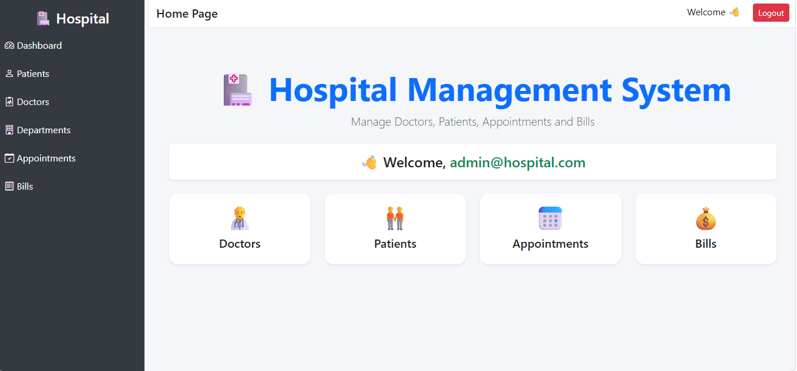
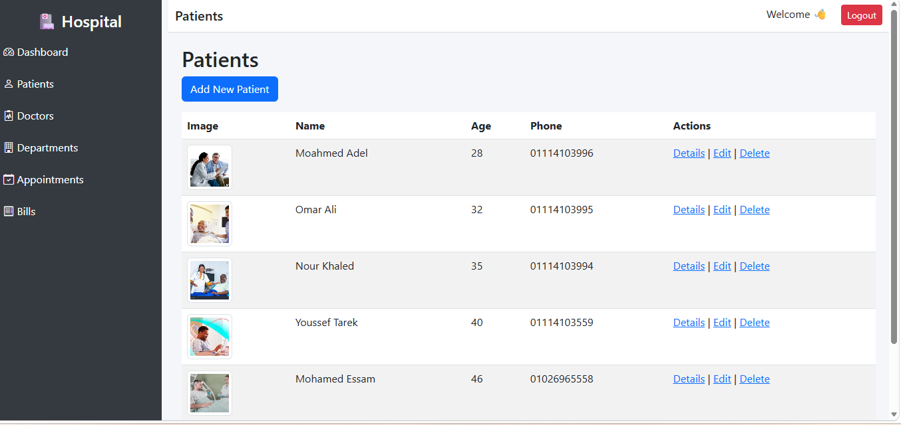
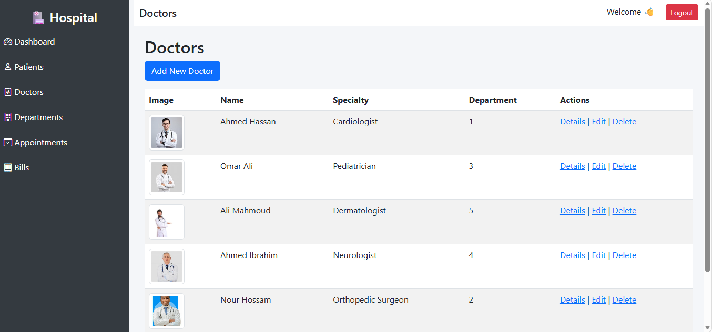
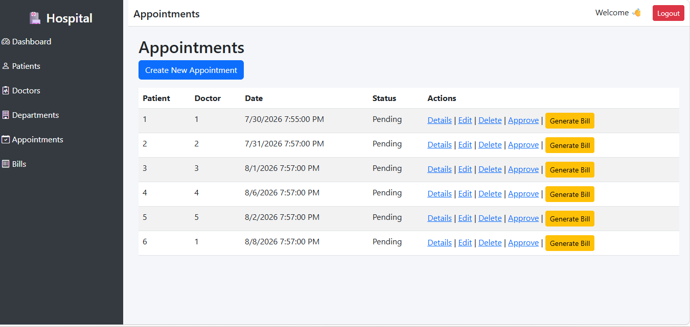
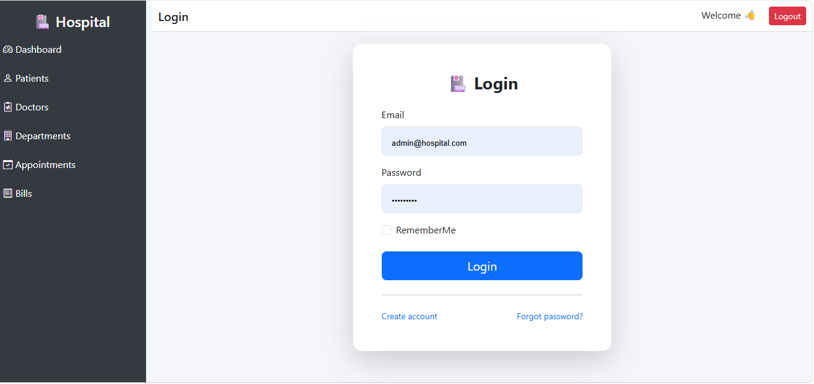
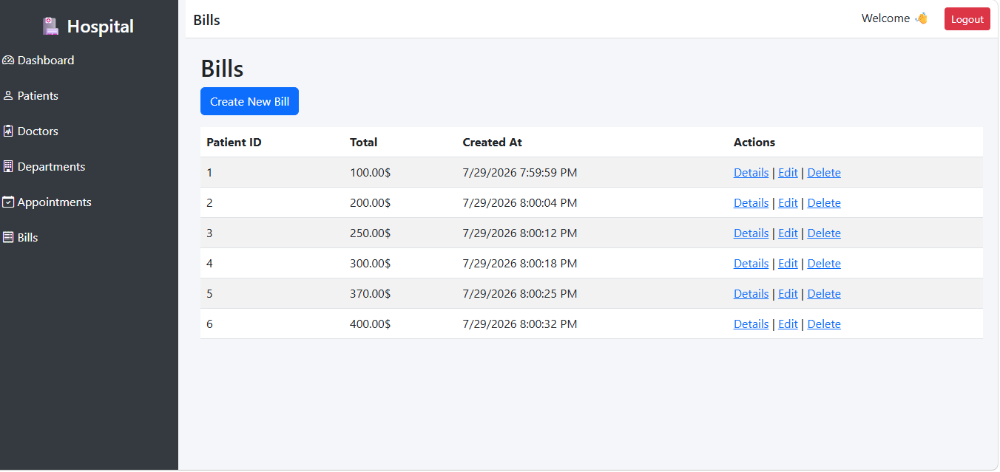

<h1 align="center">🏥 Hospital Management System</h1>

<p align="center">
A scalable and secure <b>ASP.NET Core MVC</b> Hospital Management System designed to manage core hospital operations including patients, doctors, appointments, departments, and billing.
</p>

<p align="center">
  
  
  
  
</p>

---

## 🚀 Overview

The **Hospital Management System** is a full-stack enterprise-style web application built to simulate real-world hospital operations.

It focuses on **secure user management, role-based access control, structured data handling, and scalable architecture design** using ASP.NET Core MVC and Entity Framework Core.

The system is designed with **clean separation of concerns** and follows **industry-standard design patterns**.

---

## ✨ Key Features

### 👨‍⚕️ Patient Management
- Full CRUD operations for patient records
- Advanced search & pagination
- Store medical and personal patient data
- Maintain patient history

### 🩺 Doctor Management
- Manage doctor profiles and specialties
- Assign doctors to departments
- Upload and manage profile images
- Structured doctor-directory system

### 🏥 Department Management
- Create and manage hospital departments
- Assign doctors to departments
- Maintain organizational structure

### 📅 Appointment System
- Schedule and manage patient appointments
- Track doctor–patient visits
- Maintain appointment history
- Prevent scheduling conflicts (business logic layer)

### 💰 Billing System
- Generate bills based on appointments
- Track payment status
- Maintain billing history records

---

## 🔐 Authentication & Authorization (ASP.NET Identity)

The system includes a complete authentication and authorization module:

- User registration & login
- Email confirmation system
- Role-Based Access Control (RBAC)

### 👥 Roles
- 🛡 Admin — Full system control
- 🩺 Doctor — Manage patients & appointments
- 🧾 Receptionist — Manage bookings & billing

---

## 🧱 Architecture & Design Principles

This project follows scalable software engineering practices:

- 🏛 Repository Pattern (Data abstraction layer)
- 🔄 Unit of Work Pattern (Transaction consistency)
- 🔌 Dependency Injection (Loose coupling)
- 🧼 Clean Architecture principles
- 🎯 SOLID Principles
- 📦 Layered architecture (Separation of concerns)

---

## 🛠 Tech Stack

**Backend**
- ASP.NET Core MVC
- C#

**Data Layer**
- Entity Framework Core
- SQL Server
- LINQ

**Security**
- ASP.NET Identity
- Role-based Authorization

**Frontend**
- Razor Views
- Bootstrap 5
- HTML5 / CSS3 / JavaScript

---

## 🗄 Database Design

The system is built around a relational database model including:

- Patients
- Doctors
- Departments
- Appointments
- Bills
- Users & Roles

---

## 📸 Screenshots

### 🏠 Dashboard


### 👨‍⚕️ Patients Management


### 🩺 Doctors Management


### 📅 Appointments


### 🔐 Login Page


### 💰 Bills


---

## ⚙️ Setup Instructions

```bash
git clone https://github.com/USERNAME/HospitalManagementSystem.git
